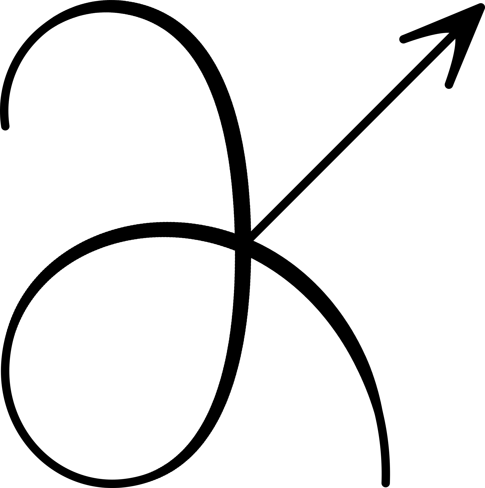

<p align="center">
  
</p>

# DerivKit
Efficient, reliable, and well-tested derivatives for scientific forecasting.

DerivKit provides a unified framework for numerical derivatives, Fisher/DALI expansions, and model forecasting — designed for cosmology but general-purpose across scientific domains.

---

##  About
DerivKit grew out of practical needs in cosmological inference — combining flexible derivative estimators with rigorous error control and clean, modern APIs.

- **Documentation:** https://docs.derivkit.org  
- **Website:** https://derivkit.org
---

##  Key Repositories
- [**derivkit**](https://github.com/derivkit/derivkit) — Core API for derivatives and forecasts  
- [**derivkit-examples**](https://github.com/derivkit/examples) — Tutorials, demos, and benchmarks  

---

##  Citation
If you use **DerivKit** in your research, please cite it as follows:

```bibtex
@software{sarcevic2025derivkit,
  author       = {Nikolina Šarčević
                  and Matthijs van der Wild
                  and Cynthia Trendafilova
                  and Bastien Carreres},
  title        = {derivkit: A Python Toolkit for Numerical Derivatives},
  year         = {2025},
  publisher    = {GitHub},
  journal      = {GitHub Repository},
  howpublished = {\url{https://github.com/derivkit/derivkit}},
}
```

---

##  License and Maintenance
DerivKit is released under the **MIT License** and actively maintained by  
[@nikosarcevic](https://github.com/nikosarcevic) and the DerivKit team.
