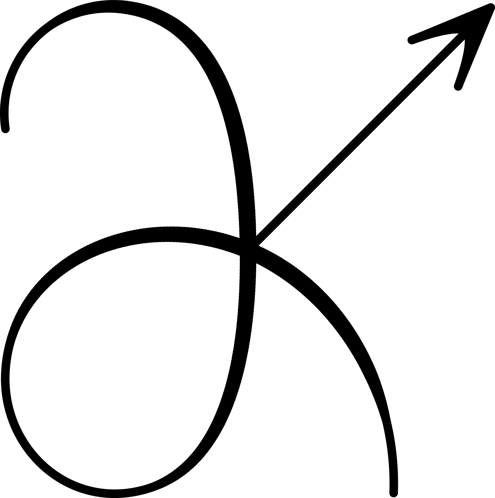
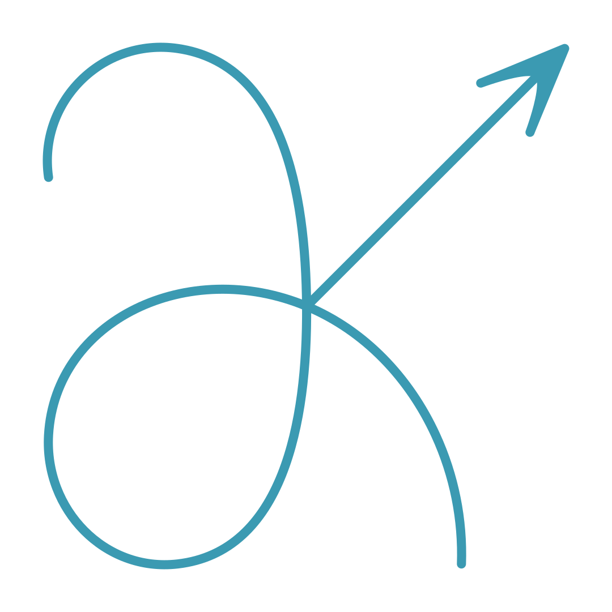
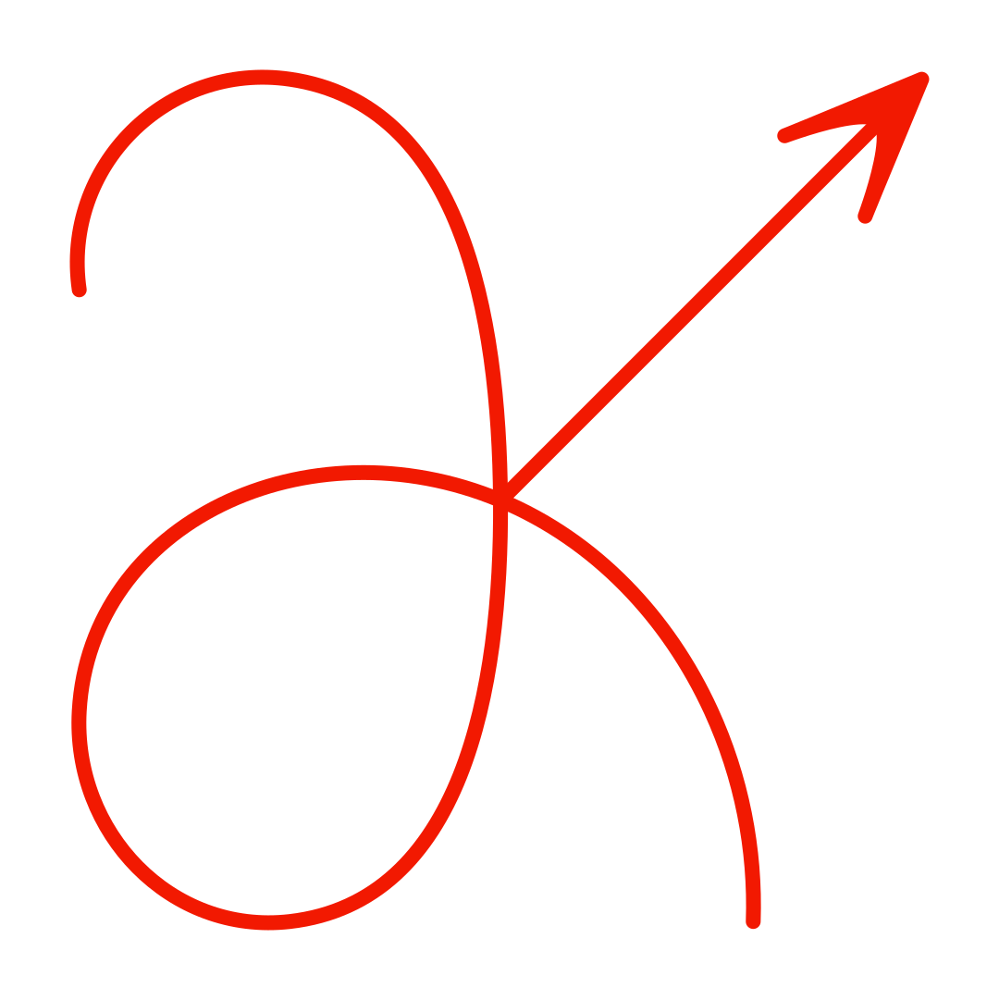

<p align="center">
  
</p>

<h1 align="center">DerivKit</h1>

<p align="center">
  <strong>Efficient, reliable, and well-tested derivatives for scientific forecasting.</strong>
</p>

<p align="center">
  DerivKit provides a unified framework for numerical derivatives, Fisher/DALI expansions,
  and model forecasting — designed for cosmology, but general-purpose across scientific domains.
</p>

<p align="center">
  <a href="https://docs.derivkit.org">
    
  </a>
  <a href="https://derivkit.org">
    
  </a>
  <a href="https://github.com/derivkit/derivkit">
    
  </a>
</p>


## About

DerivKit grew out of practical needs in cosmological inference, combining flexible derivative estimators with rigorous error control and clean, modern APIs.

## Packages

<table>
  <tr>
    <td width="50%" valign="top">
      <p>
        
        <a href="https://github.com/derivkit/derivkit">
          <span style="font-size:22px;"><strong><span style="color:#3b9ab2;">derivkit</span></strong></span>
        </a>
      </p>
      <p>
        Core Python package for numerical derivatives, Fisher forecasting,
        DALI expansions, and scientific inference workflows.
      </p>
      <p>
        <a href="https://github.com/derivkit/derivkit"><strong>View repository →</strong></a>
      </p>
    </td>
    <td width="50%" valign="top">
      <p>
        
        <a href="https://github.com/derivkit/derivkit-demos">
          <span style="font-size:22px;"><strong><span style="color:#f21901;">derivkit-demos</span></strong></span>
        </a>
      </p>
      <p>
        Tutorials, worked examples, benchmarks, and practical demonstrations
        for learning and testing DerivKit in real workflows.
      </p>
      <p>
        <a href="https://github.com/derivkit/derivkit-demos"><strong>View repository →</strong></a>
      </p>
    </td>
  </tr>
</table>

---

## Citation

If you use **DerivKit** in your research, please cite:

```bibtex
@misc{sarcevic2026derivkitstablenumericalderivatives,
  title         = {DerivKit: stable numerical derivatives bridging Fisher forecasts and MCMC},
  author        = {Šarčević, Nikolina and van der Wild, Matthijs and Trendafilova, Cynthia},
  year          = {2026},
  eprint        = {2602.08078},
  archivePrefix = {arXiv},
  primaryClass  = {astro-ph.IM},
  url           = {https://arxiv.org/abs/2602.08078}
}
```

---

##  License and Maintenance
DerivKit is released under the **MIT License** and actively maintained by  
[@nikosarcevic](https://github.com/nikosarcevic), [@lonbar](https://github.com/lonbar) and the DerivKit team.
